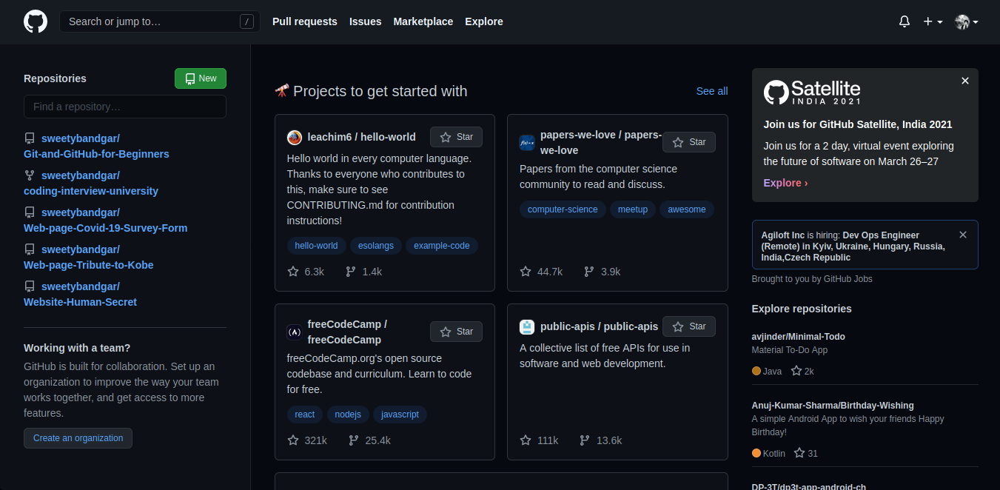
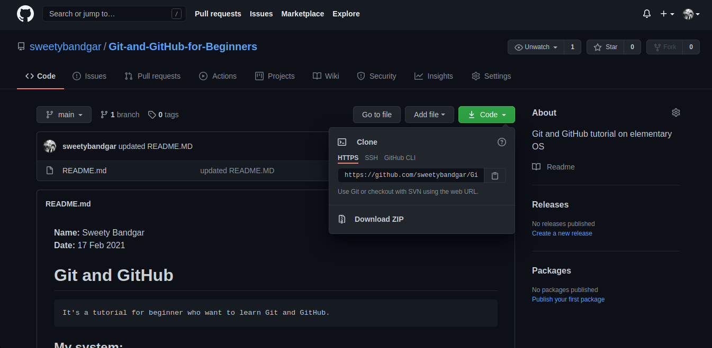

**Name:** Sweety Bandgar \
**Date:** 17 Feb 2021 
>*While typing the commands given in the tutorial don't put <__ __>. It's just for understanding.*

# Git and GitHub 

    It's a tutorial for beginner who want to learn Git and GitHub.

### My system: 
    - Laptop: Lenovo Ideapad 310
    - Core: Intel i5 (7th gen)
    - Memory: 1TB HDD
    - Operating System: Elementary OS 

# All terms and instructions 

### What is Git? 
    Ans: Free and open source version control system.

### What is version control system?
    Ans: The management of changes to documents, computer programs large web sites, and other collections of information.

### what is GitHub? 
    Ans: A website to host your repositories projects online.  
    Being online it makes eay to work in groups with other people and organize your projects into a portfolio for you to show hte potential employers.

### Terms
1. **Directory:** Folder 
2. **Terminal or Command Line:** Interface for Text Commands 
3. **CLI:** Command Line Interface 
4. **cd:** Change Directory 
5. **Code Editor:** Word Processor for Writing Code (will be using VS Code) 
6. **Repository:** Project, or folder/place where your project is kept 

### Git Commands    
- **clone:** Bring a respository that is hosted somewhere like Github into a folder on your local machine.
- **add:** Track your files and changes in Git.
- **commit:** Save your files in Git
- **push:** Upload Git commits to remote repository like Github.
- **pull:** Download changes from remote repository to your local machine, the opposite of push.

### Sign Up in GitHub
1. Open [GitHub official website](https://github.com/) and sign up there.

    
2. Create new repository by click the "+" sign on top-left side corner or by clicking the "new" green button.

    
3. First create new file "README" for your project. Learn [Markdown here](https://commonmark.org/help/tutorial/) for creating attractive readme file.

### Using Git for local machine
1. Check if git is already installed on your machine. Open your terminal and type this command.

    ``` 
    git --version
    ```
    
2. If git is not installed. I recommend to go through this [website](https://www.atlassian.com/git/tutorials/install-git) to install it. 

### Getting a code editor
+ Any word processor will work but i recommend to use Visual Code made by microsoft. It is widely used by professionals and its totally free. 
+ You can download [it from here.](https://code.visualstudio.com/download)

### Cloning through VS Code
1. First *create a folder* named git or choose own your own. 
2. Open the above folder in VS code.
3. Go to your recently created Github repository and open the https or ssh link. \
(*click the code or download green button on middle right side after you open the repository*) 

    

4. Open VS Code terminal. (*click on View in menu bar of VS Code and select terminal or use Ctrl+` key shortcut*) 
5. Type this command in terminal.
    ```
    git clone <__your https/ssh repository link__>
    ```
6. Your Github repository will get copied to your local machine. Open the respository now by typing the below command in VS Code terminal.
    ```
    cd Your <__repository name__>
    ```
### Git commit command
1. Change anything you want in your project and to save this change in git, we will use commit command.
2. Before using commit command. Lets tell git to track all the changes done. Type the below command in terminal. \
*This command track all the new changes done in the repository.*
    ```
    git add .
    ```
    *You can also track a specific file.*
    ```
    git add <__file name that you want to track__>
    ```
3. Lets see the status of git. Type the below command in terminal. \
*This command show all the updation/ creation/ deletion done in the repository.*
    ```
    git status
    ```
3. Now, we will commit the changes with some title message and description (optional). \
*This command will commit the changes. The first -m is message title like what change you did? and second is description like why did you do that change?*
    ```
    git commit -m "<__message title__>" -m "<__description__>"
    ```

### SSH keys *(optional if not using HTTPS link)*
1. In order to push changes to our github account, we have to prove that we are the owner of that account.
2. **SSH key:** *connect our local machine to github account.*
3. Generate SSH key locally. Type the below code in terminal. \
    *-t: type of encryption, -b: strength of encryption*
    ```
    ssh-keygen -t rsa -b 4096 -C "<__github email address__>"
    ```
4. Search for the generated key. Type the below command in terminal.
    ```
    ls | grep <__file name where you saved your key while generating the key__>
    ```
5. Print out the public key and copy it. Type the below command in the terminal.
    ```
    cat <__key name__>.pub
    ```
6. Add this ssh key to your github account. 
    - go to your github account
    - open setting and select SSH and GPG key
    - click on new SSH key green button 
    - give any title and paste the copied key 
    - click add SSH key
7. Make sure your local git command line interface knows about this key.
    + start the ssh agent in background.
        ```
        eval "$(ssh-agent -s)"
        ```
        You will get: 
        ```
        Agent pid <__some number__>
        ```
    + Add your SSH private key to the ssh-agent.
        ```
        ssh-add <__location of the private key__>
        ```
    + Use [this link](https://docs.github.com/en/github/authenticating-to-github/generating-a-new-ssh-key-and-adding-it-to-the-ssh-agent#adding-your-ssh-key-to-the-ssh-agent) for more details.

### Git push command
1. We have only saved the changes locally on our machine and not on github. So to save on github also, we will use push command.
2. *This command save the changes remotely on github.*
    ```
    git push origin main
    ```
    OR simply
    ```
    git push 
    ```
### When you create github repository locally
1. Create new folder on your machine where you have cloned your previous repository.
2. Open this folder's directory in terminal.
    ```
    cd <__folder name__>
    ```
3. Create README.md in this folder.
4. Make this folder a git respository. Type this command in terminal.
    ```
    git init
    ```
5. Save the changes made in this repository.
    ```
    git add .
    ```
6. Track the changes made.
    ```
    git status
    ```
7. Commit the changes made.
    ```
    git commit -m <__message title__> -m <__description__>
    ```
8. Generate a connection between the github account and this local repository.
    + go to your github account
    + create a new respository
    + copy the HTTPS/ SSH link of the remote repository made on github
    + Add reference to this remote repository through the local repository.
        ```
        git remote add origin <__HTTPS/ SSH link of the remote repository__>
        ```
9. See all the remote repositories connected to this local repository.
    ```
    git remote -v
    ```
10. Push the changes on the remote repository.
    ```
    git push origin master
    ```


